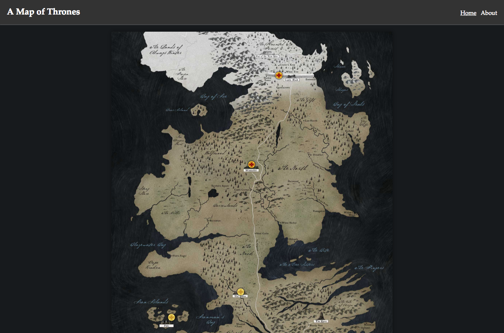
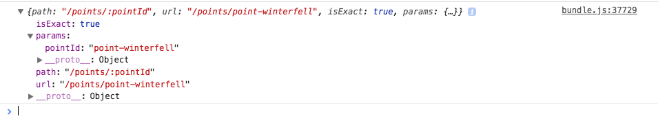
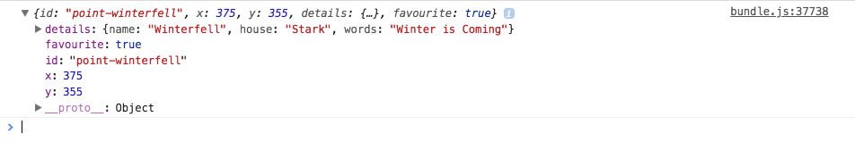

> _Note:_ The starting point of this example is after Step 25. You can get there
> by running `git checkout master`. <br><br> The finished version of this bonus
> lesson is in the branch `bonus/react-router`. To see it run `git checkout
> bonus/react-router`.

One feature that almost all applications need is a way to navigate between
pages, a.k.a routing. As React is not a framework it does not ship with any
direct way to achieve this. Instead we must use an open-source solution that
allows us to apply routing in the React component based style.

The most popular routing solution in the React community is currently named
`react-router` [^1]. This library is a core React routing library and offers
extensions based on how you want to use it, such as:

* `react-router-dom` (For DOM based websites)
* `react-router-native` (For React Native)
* `react-router-redux` (Connect React Router with Redux)

We will be focussing on `react-router-dom` as it is the simplest implementation
that we can use for this example but be aware that `react-router-redux` is often
used so that you can control the navigation by pushing Redux actions.

## Installing up React Router

We will first install the `react-router-dom` package and its dependencies.

```bash
yarn add react-router-dom
```

## Creating the About Page

Next we will create a static "about" page with some basic text information so
that we have something to navigate too, in order to test the routing.

Let's create a simple `<About />` component in the components directory. As
usual we will start by creating a directory with an `index.js` file in it that
will export our default component.

```js
// app/js/components/About/index.js

export { default } from './About';
```

Next we will create the actual component and implement a stateless functional
component that returns the content of the about page.

First we import `React` as it must be in scope in order to use JSX. We then
define the `About` component and return some simple text content, finally
exporting the `About` constant as the default export.

One interesting thing you may notice here is the use of a `style` property
instead of using a CSS file for styling. Since we only need some simple paddings
this highlights that you can simply pass an object of styles to the `style` prop
and React will compile this for you. The format is always an object of the style
properties with the keys in camel case. e.g. `paddingLeft` as opposed to
`padding-left`. React will then compile this to a style attribute as
`style="padding-left: 20px;"`.

```jsx
// app/js/components/About/About.jsx

import React from 'react';

const About = () => {
  return (
    <section style={{ paddingLeft: 20, paddingRight: 20 }}>
      <h2>About</h2>

      <p>
        Lorem ipsum dolor sit amet, consectetur adipiscing elit. Donec volutpat
        tincidunt felis, at auctor augue pharetra non. Nam lacinia leo eu
        tincidunt porttitor. Quisque congue facilisis bibendum. Phasellus
        vehicula ante a congue tempor. Aliquam sed imperdiet enim. Maecenas et
        diam quis turpis volutpat lacinia et in odio. Nunc auctor euismod quam
        ac imperdiet. Nam sodales, ante ac accumsan commodo, ante leo
        sollicitudin augue, ut maximus elit sapien ut lectus.
      </p>

      <p>
        Integer varius, odio vitae cursus gravida, felis sem molestie risus, in
        ornare nisl nisi a ante. Sed consectetur molestie ante vitae viverra.
        Phasellus vel porta ipsum. Proin rutrum blandit ipsum, eu sodales mi
        consectetur vitae. Quisque fringilla fermentum iaculis. Nullam
        ullamcorper nec sapien sit amet tincidunt. Sed dictum erat nec erat
        sodales gravida. Vestibulum tempor imperdiet convallis. Duis ligula
        neque, finibus id luctus quis, dignissim et diam. Donec elit mi, feugiat
        mattis justo id, imperdiet semper lectus.
      </p>
    </section>
  );
};

export default About;
```

## Setting up the Layout

We are now ready to start implementing the router. The first thing we will need
is a layout file. A layout is used to define common elements that will be seen
on all pages, such as a navigation bar. In this file we will also define our
different routes and pages.

Let's start by creating a `<Layout />` component in the usual way. Create an
index file at `app/js/components/Layout/index.js` and perform an export from the
`Layout` file.

```js
// app/js/components/Layout/index.js

export { default } from './Layout';
```

Next create the actual `Layout.js` file and start off by exporting a simple
stateless functional component.

```jsx
// app/js/components/Layout/Layout.jsx

import React from 'react';

const Layout = () => {
  return <div />;
};

export default Layout;
```

#### Router Types

We are now ready to apply the React Router. The first thing to do is to choose
which router type we plan to use. The three main options are:

* `BrowserRouter` - Uses push state, e.g. `/myroute`
* `HashRouter` - Uses "hash" based history, e.g. `/#/myroute`
* `MemoryRouter` - Navigation in memory, no browser navigation possible

I would recommend trying all three of these options and seeing the difference in
action. However, for this example we will start by using the `HashRouter`.

The reason we do not use `BrowserRouter` is that if we are on the `/about` route
and the page is reloaded we get a `404 Not Found` error due to the fact we only
have an `index.html` file in our public directory and the browser is instead
looking for a file called "about".

The `HashRouter` solves this by always serving from the index file but keeping
the routes stored in the URL hash.

We will implement our `HashRouter` by importing the component from
`react-router-dom` and inserting into our `Layout` component.

```diff
// app/js/components/Layout/Layout.jsx

  import React from 'react';
+ import { HashRouter } from 'react-router-dom';

  const Layout = () => {
-   return <div />;
+   <HashRouter>
+     <div />
+   </HashRouter>
  };

  export default Layout;
```

We now need to use `Route` components from `react-router-dom` to define the
configuration of our routes. Each route component has props for the component
that it should show and the URL path that should be matched in order for that
route to be shown. If the path matches the current browser URL, the associated
component will be displayed wherever the `<Route />` component is placed.

We will create a configuration option of routes that we will then map into our
view.

```diff
// app/js/components/Layout/Layout.jsx

  import React from 'react';
- import { HashRouter } from 'react-router-dom';
+ import { HashRouter, Route } from 'react-router-dom';

+ import App from '../App';
+ import About from '../About';

+ const routes = [
+   { path: '/', component: App, exact: true },
+   { path: '/about', component: About }
+ ];

  const Layout = () => {
    <HashRouter>
-     <div />
+     <div>
+       <section>
+         {routes.map(route => <Route {...route} key={route.path} />)}
+       </section>
+     </div>
    </HashRouter>
  };

  export default Layout;
```

As you can see, we have imported the `App` component which is the main view of
our application (containing the map and favourites list). We also import the
newly created `About` component.

We define that the `App` component will be shown on the `/` route and that
`About` should be shown when the browser points to `/about`.

The reason we need to specify the `exact` prop from the `App` route is that
`/about` also matches `/` since they both start with a slash. This tells the
router to only show the `App` component if the URL matches the path exactly,
otherwise both the `App` and `About` components would be rendered when visiting
`/about`.

#### Navigation Links

We can now already move between these components by changing the URL. If you
navigate in your browser to `/#/about` you should already see the About page
text content.

It would be a lot easier to navigate back and forward if we have navigation
links though. React Router also provides us with this functionality via a
component called `NavLink`.

We can use this built in component which will create `<a>` anchor tags for us
but will also offer functionality such as highlighting the active page and will
also build the link to respect our router type.

We will add our navigation by first importing `NavLink` from `react-router-dom`
and then adding the links into a `<header>` tag inside of our Layout, above the
`<Route>` components.

```diff
// app/js/components/Layout/Layout.jsx

  import React from 'react';
- import { HashRouter, Route } from 'react-router-dom';
+ import { HashRouter, Route, NavLink } from 'react-router-dom';

  import App from '../App';
  import About from '../About';

  const routes = [
    { path: '/', component: App, exact: true },
    { path: '/about', component: About }
  ];

  const Layout = () => {
    <HashRouter>
      <div>
+       <header>
+         <h2>A Map of Thrones</h2>
+         <nav>
+           <NavLink to="/" exact>
+             Home
+           </NavLink>
+           <NavLink to="/about">About</NavLink>
+         </nav>
+       </header>
+
        <section>
          {routes.map(route => <Route {...route} key={route.path} />)}
        </section>
      </div>
    </HashRouter>
  };

  export default Layout;
```

Try clicking on these links and you will be able to move between our defined
routes.

> _Note:_ We must sepcify the `exact` prop on the "Home" link for the same
> reason as we do on the route config. Without this when on the "About" page,
> both "About" and "Home" would be marked as active.

#### Styling the Layout

Finally we will add some CSS styles that will be used style our navigation bar,
which we will be adding momentarily. Create a `Layout.css` file in our component
and add the following styles:

```css
/* app/js/components/Layout/Layout.css */

:root {
  --mastheadBackground: #333;
  --space: 20px;
}

.masthead {
  padding: var(--space);
  margin: 0 0 var(--space) 0;
  background: var(--mastheadBackground);
  box-shadow: rgba(255, 255, 255, 0.7) 0 0 3px;
  display: flex;
  justify-content: space-between;
}

.title {
  margin: 0;
  padding: 0;
}

.navigation {
  padding-top: 8px;

  a {
    color: var(--text);
    margin-left: 12px;
    text-decoration: none;

    &:hover,
    &[aria-current='true'] {
      text-decoration: underline;
    }
  }
}
```

Finally import and apply these styles to our Layout component.

```diff
// app/js/components/Layout/Layout.jsx

  ...

+ import styles from './Layout.css';

  const routes = [
    { path: '/', component: App },
    { path: '/about', component: About }
  ];

  const Layout = () => {
    <HashRouter>
      <div>
-       <header>
+       <header className={styles.masthead}>
-         <h2>A Map of Thrones</h2>
+         <h2 className={styles.title}>A Map of Thrones</h2>
-         <nav>
+         <nav className={styles.navigation}>
            <NavLink to="/" exact>
              Home
            </NavLink>
            <NavLink to="/about">About</NavLink>
          </nav>
        </header>

        <section>
          {routes.map(route => <Route {...route} key={route.path} />)}
        </section>
      </div>
    </HashRouter>
  };
```

## Rendering the Layout

In order to see our new layout we have to render this in our application instead
of just the `App` component that is currently rendered from the `application.js`
file.

Replace the import of `App` with `Layout` and render this instead to see our new
application with navigation.

```diff
// app/js/application.js

  import React from 'react';
  import { render } from 'react-dom';
  import { createStore } from 'redux';
  import { Provider } from 'react-redux';

- import App from './components/App';
+ import Layout from './components/Layout';
  import reducers from './reducers';

  const store = createStore(
    reducers,
    window.__REDUX_DEVTOOLS_EXTENSION__ && window.__REDUX_DEVTOOLS_EXTENSION__()
  );

  render(
    <Provider store={store}>
-     <App />
+     <Layout />
    </Provider>,
    document.getElementById('app')
  );
```



## Adding an Existing Component as a Page

Now that we have our routing setup, it is trivial to add new pages. For example
it may make sense to have the Favourites List feature on it's own page instead
of hidden below the map.

We can add this new page in 2 steps. First we import the
`ConnectedFavouritesList` and add an entry to our routing configuration.

```diff
// app/js/components/Layout/Layout.jsx

  ...

  import App from '../App';
  import About from '../About';
+ import ConnectedFavouritesList from '../FavouritesList';

  import styles from './Layout.css';

  const routes = [
    { path: '/', component: App },
    { path: '/about', component: About },
+   { path: '/favs', component: ConnectedFavouritesList }
  ];
```

Finally we will add a `NavLink` for the new page to our header.

```diff
// app/js/components/Layout/Layout.jsx

  ...

  <nav className={styles.navigation}>
    <NavLink to="/" exact>
      Home
    </NavLink>
    <NavLink to="/about">About</NavLink>
+   <NavLink to="/favs">Favourites</NavLink>
  </nav>
```

You will not see a "Favourites" link in the navigation which when clicked on
will show the favourites list.

The delete actions even work as the component was already connected to Redux.

## Dynamically Building the Navigation Links

Although it was easy to add a new page, it still took 2 steps. You may also
notice that most of the information is the same between the `Route` and
`NavLink` props, so it would make more sense to share these.

Let's also dynamically build the navigation as we do with the routes. We will
first have to add the `title` of each link to the route configuration.

```diff
const routes = [
-  { path: '/', component: App, exact: true },
-  { path: '/about', component: About },
-  { path: '/favs', component: ConnectedFavouritesList }
+  { path: '/', component: App, title: 'Home', exact: true },
+  { path: '/about', component: About, title: 'About' },
+  { path: '/favs', component: ConnectedFavouritesList, title: 'Favourites' }
];
```

Finally, map over the config within the `<header>` to create the links.

```diff
  <nav className={styles.navigation}>
-   <NavLink to="/" exact>
-     Home
-   </NavLink>
-   <NavLink to="/about">About</NavLink>
-   <NavLink to="/favs">Favourites</NavLink>
+   {routes.map(route => (
+     <NavLink to={route.path} exact={route.exact} key={route.path}>
+       {route.title}
+     </NavLink>
+   ))}
  </nav>
```

## Working with Parameters

The final thing that I would like to show is how to pass parameters in the URL.
This will be demonstrated by adding a link to each point on the map which when
clicked on will show the details of that point on it's own page.

#### Linking to the Point

The first thing we will do is add the `<NavLink />` link to the `<Pointer />`
component around the title.

First import `NavLink`:

```diff
// app/js/components/Pointer/Pointer.jsx

  import React, { Component } from 'react';
  import PropTypes from 'prop-types';
  import classNames from 'classnames';
  import { connect } from 'react-redux';
+ import { NavLink } from 'react-router-dom';

  import { addFavourite, removeFavourite } from '../../actions';
  import styles from './Pointer.css';

  ...
```

Then update the `render` method to apply this link in the `<h3>` tag. We must
also destructure the `id` prop so that it can be used in the link target.

```diff
// app/js/components/Pointer/Pointer.jsx

  render () {
-   const { x, y, details, favourite } = this.props;
+   const { x, y, details, favourite, id } = this.props;
    const { name, house, words } = details;

    const pointerClasses = classNames(styles.pointer, {
      [styles.favourite]: favourite
    });

    const detailsClasses = classNames(styles.details, {
      [styles.hidden]: !this.state.open
    });

    return (
      <div
        className={pointerClasses}
        style={{ left: x, top: y }}
        onClick={this.toggle}
      >
        <div className={detailsClasses}>
          <header className={styles.headline}>
-           <h3>{name}</h3>
+           <h3>
+             <NavLink to={`/points/${id}`}>{name}</NavLink>
+           </h3>
            <div className={styles.detailsControls}>
              <a
                href="#favourite"
                className={styles.control}
                onClick={this.favourite}
              >
                {favourite ? '–' : '+'}
              </a>

              <a
                href="#toggle"
                className={styles.control}
                onClick={this.toggle}
              >
                &times;
              </a>
            </div>
          </header>

          <p>House: {house}</p>
          <p>Words: {words}</p>
        </div>
      </div>
    );
  }
```

You can also add styles to make the link look a little nicer.

```diff
/* app/js/components/Pointer/Pointer.css */

  h3 {
    margin: 5px 0;
+
+   a {
+     color: #fff;
+     text-decoration: none;
+     transition: 0.3s color;
+
+     &:hover {
+       color: #999;
+     }
+   }
  }
```

#### Creating the Detail View

Begin by creating a `DetailsView` component in the same way as we created
`About`, earlier. Start with an `index.js` file then create a simple functional
component inside of `DetailsView.jsx`.

```js
// app/js/components/DetailsView/index.js

export { default } from './DetailsView';
```

```jsx
// app/js/components/DetailsView/DetailsView.jsx

import React from 'react';

const DetailsView = () => {
  return <div />;
};

export default DetailsView;
```

Since the detail view will need access to the points data we will now connect
the `DetailsView` to Redux. Once connected we will use a `mapStateToProps`
function to pass the `points` as a prop to the component.

```diff
// app/js/components/DetailsView/DetailsView.jsx

  import React from 'React';
+ import PropTypes from 'prop-types';
+ import { connect } from 'react-redux';

- const DetailsView = () => {
-   return <div />;
- };
+ const DetailsView = ({ points }) => {
+   return <div />;
+ };
+
+ DetailsView.propTypes = {
+   points: PropTypes.array.isRequired
+ };
+
+ const mapStateToProps = state => {
+   return {
+     points: state.points
+   };
+ };
+
+ const ConnectedDetailsView = connect(mapStateToProps)(DetailsView);
+
- export default DetailsView;
+ export default ConnectedDetailsView;
```

#### Applying the new Route

Now that we have a component we must add it to our `routes` config in the
layout. Since we do not want this route to appear on the navigation bar we will
not give it a title. We then have to ensure that any routes without a `title`
attribute are filtered out when creating the navigation links.

We specify the optional paramter in our route by using the `:param` syntax in
the path. In this case we specify the parameter `:pointId` that will be matches
from any URL that starts with `/points/`. e.g. `/points/point-winterfell`.

```diff
// app/js/components/Layout/Layout.jsx

  ...

  import App from '../App';
  import About from '../About';
  import ConnectedFavouritesList from '../FavouritesList';
+ import ConnectedDetailsView from '../DetailsView';

  const routes = [
    { path: '/', component: App, title: 'Home', exact: true },
    { path: '/about', component: About, title: 'About' },
-   { path: '/favs', component: ConnectedFavouritesList, title: 'Favourites' }
+   { path: '/favs', component: ConnectedFavouritesList, title: 'Favourites' },
+   { path: '/points/:pointId', component: ConnectedDetailsView }
  ];

  ...

  <nav className={styles.navigation}>
-   {routes.map(route => (
+   {routes.filter(route => route.title).map(route => (
      <NavLink to={route.path} exact={route.exact} key={route.path}>
        {route.title}
      </NavLink>
    ))}
  </nav>
```

#### Accessing the Params

A component that is rendered via a React Router `Route` component will
automatically recieve a prop called `match`. The `match` prop contains
information about the current route such as the path, url, and params.

If we log the `match` prop it looks like this:



From this information you can see that we will be able to access the `pointId`
parameter via `this.props.match.params.pointId` (`point-winterfell`) which gives
us the ID of the point that was clicked on because it is in the current URL
`/#/points/point-winterfell`.

So we can now combine this information with the points from Redux in order to
find which one we should show.

```diff
// app/js/components/DetailsView/DetailsView.jsx

  import React from 'React';
  import PropTypes from 'prop-types';
  import { connect } from 'react-redux';
  import { NavLink } from 'react-router-dom';

- const DetailsView = ({ points }) => {
+ const DetailsView = ({ points, match }) => {
+   const point = points.filter(point => point.id === match.params.pointId)[0];
+
+   console.log(match);
+   console.log(point);
+
    return <div />;
  };

  DetailsView.propTypes = {
-   points: PropTypes.array.isRequired
+   points: PropTypes.array.isRequired,
+   match: PropTypes.object.isRequired
  };

  const mapStateToProps = state => {
    return {
      points: state.points
    };
  };

  const ConnectedDetailsView = connect(mapStateToProps)(DetailsView);

  export default ConnectedDetailsView;
```

We use the `pointId` param from the URL and filter the Redux `points` for the
correct entry. If we log this information we will see that we have all of the
data for this point:



> _Note:_ There is no error handling here, if the point ID in the URL is not
> found, an error will occur. In a production application you must make sure to
> handle this.

So finally, now that we have the information about the point, we will show this
information on the page. We will destructure the point details and render it in
the component.

```diff
// app/js/components/DetailsView/DetailsView.jsx

  ...

+ import { NavLink } from 'react-router-dom';

  ...

  const DetailsView = ({ points, match }) => {
    const point = points.filter(point => point.id === match.params.pointId)[0];
+   const { name, house, words } = point.details;

-   console.log(match);
-   console.log(point);
+
+   return (
+     <section style={{ paddingLeft: 20, paddingRight: 20 }}>
+       <header>
+         <h2>{name}</h2>
+       </header>
+
+       <p>House: {house}</p>
+       <p>Words: {words}</p>
+
+       <p>
+         <NavLink to="/">Back</NavLink>
+       </p>
+     </section>
+   );
  };
```

Try clicking on the title of a popup on the map and you will see the details
from this view.

## Next Steps

At this stage you should be starting to feel comfortable with React. There are a
few "nice-to-have" features that could be added to this bonus example. If you
feel like going further, you may want to:

* Link the `FavouritesList` entries to the `DetailsView` route.
* Add/Remove favourites from the `DetailsView` using Redux actions.
* Write tests for the `About` component.
* Write tests for the `DetailsView` component.
* Write tests for the `Layout` component.

You can use the existing components and tests as examples to get your started.

---

* <sup id="fn-1">[1]</sup>: https://github.com/ReactTraining/react-router
