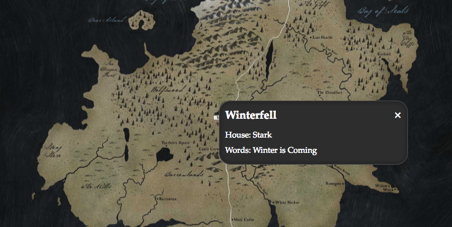

Now that we have the pointers displayed on the map the next step is to make them
clickable so that we can display the "details" information from our data in a
popup over each point.

Let's jump back into the `Pointer.jsx` file and add some markup to our `render`
method that will display the information. Update the `Pointer` class so that it
looks like:

```jsx
// app/js/components/Pointer/Pointer.jsx

class Pointer extends Component {
  render() {
    const { x, y, details } = this.props;
    const { name, house, words } = details;

    return (
      <div className={styles.pointer} style={{ left: x, top: y }}>
        <div className={styles.hidden}>
          <header className={styles.headline}>
            <h3>{name}</h3>
            <a href="#" className={styles.close}>
              &times;
            </a>
          </header>

          <p>House: {house}</p>
          <p>Words: {words}</p>
        </div>
      </div>
    );
  }
}
```

We must now also handle the `details` prop that we are accessing, so let's add
it to the `propTypes` object.

```diff
Pointer.propTypes = {
+ details: PropTypes.object.isRequired,
  x: PropTypes.number.isRequired,
  y: PropTypes.number.isRequired
};
```

Next we will add new styles the `Pointer.css` file for these new elements. Add
the following new rules after the existing ones.

```css
/* app/js/components/Pointer/Pointer.css */

.hidden {
  display: none;
}

.details {
  cursor: default;
  background: var(--detailsBackground);
  width: 300px;
  border-radius: var(--pointerSize);
  padding: 10px;
  color: #fff;
  position: relative;
  top: -3px;
  left: -3px;
  box-shadow: inset 0 0 8px 3px rgba(0, 0, 0, 0.2);
  border: 1px solid #555;

  h3 {
    margin: 5px 0;
  }

  p {
    margin: 10px 0;
    font-size: 14px;

    &:last-child {
      margin-bottom: 5px;
    }
  }
}

.headline {
  display: flex;
  justify-content: space-between;
}

.close {
  align-self: center;
  text-decoration: none;
  color: #fff;
  font-size: 20px;
  padding: 0;
  margin: 0;
}
```

Refresh your browser and you will see nothing has changed because the wrapper
`<div />` has the `.hidden` style. Next we will work on toggling the information
by clicking on the pointer.

## Working with Component State

We will track weather a popup should be shown or not by using state within the
component. Let's setup the default state in the component constructor. We will
use a state key `open` which will initially be false. Add the following
`constructor` method above the `render` method.

> _Note:_ When adding a constructor to a React component you must _always_ call
> `super` and pass the props to the parent component.

```jsx
// app/js/components/Pointer/Pointer.jsx

constructor (props) {
  super(props);

  this.state = {
    open: false
  };
}
```

Next we will add a `toggle` method which will switch the state when called. Add
this new method in-between the `constructor` and `render` methods.

```jsx
// app/js/components/Pointer/Pointer.jsx

toggle (event) {
  event.preventDefault();

  if (event.target === event.currentTarget) {
    this.setState({ open: !this.state.open });
  }
}
```

This method will be called as an `onClick` handler so it receives an `event`
argument. This is not a native browser event but an event transformed to a React
`SyntheticEvent` which is normalized so that it can be interacted with
cross-browser [^1].

We then call `preventDefault` on the event so that the default action (in this
case it will be a link click) is not handled by the browser.

Next we check that the click is happening to the original element (DOM node)
that we specified instead of a nested element such as the popup.

Finally we call the internal `setState` method which updates `this.state` and
triggers the React lifecycle [^2] to run again (e.g. calling
`componentDidUpdate` and `render` for you).

We now have to bind the `toggle` method to `this` in the constructor so that the
method is in the context of the component instance instead of `window`.

```diff
constructor (props) {
  super(props);

  this.state = {
    open: false
  };

+ this.toggle = this.toggle.bind(this);
}
```

Next apply the `onClick` handlers to the pointer itself and the close link in
the popup so that clicking either of these elements will call the `toggle`
method. Update the `render` method to add the `onClick` handlers.

```diff
// app/js/components/Pointer/Pointer.jsx

  return (
-    <div className={styles.pointer} style={{ left: x, top: y }}>
+    <div className={styles.pointer} style={{ left: x, top: y }} onClick={this.toggle}>
      <div className={styles.hidden}>
        <header className={styles.headline}>
          <h3>{name}</h3>
-          <a href="#" className={styles.close}>
+          <a href="#" className={styles.close} onClick={this.toggle}>
            &times;
          </a>
        </header>

        <p>House: {house}</p>
        <p>Words: {words}</p>
      </div>
    </div>
  );
```

If you are using the
[React Developer Tools](https://github.com/facebook/react-devtools) you may see
that clicking on the pointer now toggles the `open` state but still there is no
popup shown. This is because our details only has the class name `.hidden`. We
will now toggle the class names using the aptly named `classnames` library.

## Working with classNames

Let's go ahead and install the
[classnames](https://github.com/JedWatson/classnames) library that allows us to
conditionally apply classes based on state. First we will install it via `yarn`.

```bash
yarn add classnames
```

We then import it at the top of `Pointer.jsx`.

```diff
// app/js/components/Pointer/Pointer.jsx

  import React, { Component } from 'react';
  import PropTypes from 'prop-types';
+ import classNames from 'classnames';
```

Next, in the `render` method we will build a custom set of class names to pass
to our React component. Update the `render` method with this new code:

```diff
// app/js/components/Pointer/Pointer.jsx

  render () {
    const { x, y, details } = this.props;
    const { name, house, words } = details;
+   const detailsClasses = classNames(styles.details, {
+     [styles.hidden]: !this.state.open
+   });

    return (
      <div
        className={styles.pointer}
        style={{ left: x, top: y }}
        onClick={this.toggle}
      >
-       <div className={styles.hidden}>
+       <div className={detailsClasses}>
          <header className={styles.headline}>
            <h3>{name}</h3>
            <a href="#" className={styles.close}>
              &times;
            </a>
          </header>

          <p>House: {house}</p>
          <p>Words: {words}</p>
        </div>
      </div>
    );
  }
```

Here we have asked `classnames` to always apply the `.details` style but
conditionally add the `.hidden` class only is `this.state.open` is `false`.

> _Note:_ We have to use the ES6 `[]` object assignment syntax instead of just
> `hidden:` because we are using CSS modules - the class name is not `.hidden`
> but a generated hash.

Try it out! Now in your browser clicking on a pointer will open the details view
and clicking the `×` link will close it again.



## A Note on Binding Click Handlers

It would in theory be possible to call `this.toggle.bind(this)` inside of the
`onClick` handler, or elsewhere inside of the `render` method but this is an
anti-pattern because React component `render` methods should be pure. The idea
of React is not to "waste" renders by only updating the DOM that has really
changed. However, since calling `bind` creates a new function, every time render
is called new functions are being created, making the `render` method impure.
React can then never know for sure what has changed and will always call the
`render` method even if the DOM would have been identical [^3].

For that reason, we always bind functions that are used within `render` in the
`constructor` instead.

---

* <sup id="fn-1">[1]</sup>: https://reactjs.org/docs/events.html
* <sup id="fn-3">[2]</sup>: https://reactjs.org/docs/state-and-lifecycle.html
* <sup id="fn-2">[3]</sup>:
  https://medium.com/@esamatti/react-js-pure-render-performance-anti-pattern-fb88c101332f
