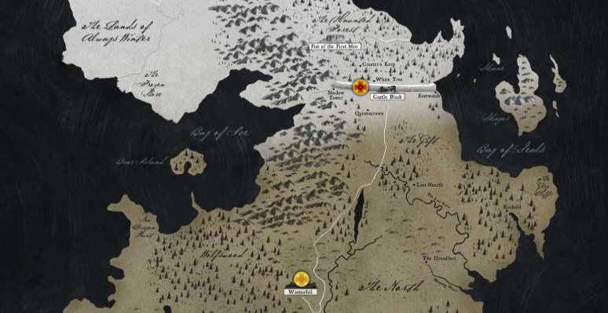

Our next step will be adding a "favourite" state to our data, so that the user
can chose which points on the map are his favourite and render them differently.

We will start by making the first item in our data a favourite point by default.
Update the `points` array in `Map.jsx` with the `favourite` key set to `true`.

```diff
// app/js/components/Map/Map.jsx

const points = [
  {
    x: 450,
    y: 110,
    details: {
      name: 'The Wall',
      house: "Night's Watch",
      words: 'Night gathers, and now my watch begins.'
    },
+   favourite: true
  },
  ....
```

We will be showing a different pointer image when a pointer has the "favourite"
state, so let's copy that asset into the application via our terminal.

```bash
cp .assets/pointer-fav.png app/img
```

We will then add a new style rule to the `Pointer.css` file which will set the
background image to the new image. Add the `.favourite` class after the
`.pointer` class.

```css
/* app/js/components/Pointer/Pointer.css */

.favourite {
  background-image: url('../../../img/pointer-fav.png');
}
```

Next we will update the internal `state` of the `Pointer` component and tell the
component if this point is a favourite or not. Since the `favourite` prop is now
being passed in from our data we have to update the `propTypes` and set
`favourite` key in our state via the passed in props.

```diff
// app/js/components/Pointer/Pointer.jsx

constructor (props) {
  super(props);

  this.state = {
    open: false,
+   favourite: props.favourite
  };

  this.toggle = this.toggle.bind(this);
}
```

```diff
// app/js/components/Pointer/Pointer.jsx

Pointer.propTypes = {
  details: PropTypes.object.isRequired,
  x: PropTypes.number.isRequired,
  y: PropTypes.number.isRequired,
+ favourite: PropTypes.bool
};
```

Finally we will again use the `classnames` library to conditionally apply the
`.favourite` style to the existing `.pointer` style, based on the state.

```diff
// app/js/components/Pointer/Pointer.jsx

render () {
  const { x, y, details } = this.props;
  const { name, house, words } = details;
+
+ const pointerClasses = classNames(styles.pointer, {
+   [styles.favourite]: this.state.favourite
+ });
+
  const detailsClasses = classNames(styles.details, {
    [styles.hidden]: !this.state.open
  });

  return (
    <div
      className={pointerClasses}
      style={{ left: x, top: y }}
      onClick={this.toggle}
    >
-     <div className={styles.pointer}>
+     <div className={detailsClasses}>
        <header className={styles.headline}>
          <h3>{name}</h3>
          <a href="#" className={styles.close} onClick={this.toggle}>
            &times;
          </a>
        </header>

        <p>House: {house}</p>
        <p>Words: {words}</p>
      </div>
    </div>
  );
}
```

If you look at the browser you will seethe first point on the map now has a red
background image instead of simply being yellow.



## Toggle the favourite state

Now we have the favourite state working if it was originally defined in the
`points` dataset. Let's work on adding controls so the user can choose which
points to make a favourite, or not.

We will be adding a plus/minus link beside the close link in the details popup
to control the favourite state. For that reason we will first of all refactor
our styles for the controls, so that the `.close` button style can be shared.

```diff
/* app/js/components/Pointer/Pointer.css */

+ .detailsControls {
+   .control {
+     margin-left: 10px;
+   }
+ }
+
- .close {
+ .control {
```

We will then also have to update our popup template so that the close link and
the new favourite toggle link are inside of the `.designControls` wrapper and
that both links now have the class name `.control`.

The favourite toggle link will render either a `+` or `-` text inside of it
conditionally based on the current favourite state.

```diff
// app/js/components/Pointer/Pointer.jsx

  <header className={styles.headline}>
    <h3>{name}</h3>
-   <a href="#" className={styles.close} onClick={this.toggle}>
-     &times;
-   </a>
+
+   <div className={styles.detailsControls}>
+     <a href="#" className={styles.control}>
+       {this.state.favourite ? '–' : '+'}
+     </a>
+
+     <a href="#" className={styles.control} onClick={this.toggle}>
+       &times;
+     </a>
+   </div>
  </header>
```

We will now a new method called `favourite` that is similar to the `toggle`
method. It will read the current value of `this.state.favourite` and set a new
state with the toggled (opposite) value. Add this method below `toggle` and
remember to bind its context in the constructor.

```diff
// app/js/components/Pointer/Pointer.jsx

constructor (props) {
  super(props);

  this.state = {
    open: false,
    favourite: props.favourite
  };

  this.toggle = this.toggle.bind(this);
+ this.favourite = this.favourite.bind(this);
}

...

+favourite () {
+  this.setState({ favourite: !this.state.favourite });
+}

render () {
...
```

The final step is to add the onClick handler for the `favourite` method.

```diff
// app/js/components/Pointer/Pointer.jsx

- <a href="#" className={styles.control}>
+ <a href="#" className={styles.control} onClick={this.favourite}>
    {this.state.favourite ? '–' : '+'}
  </a>
```

When you now click on a pointer to open the details popup, you can click on the
`+` or `-` symbol and see that it switches each time. If you close the popup you
will see that the favourite state has been reflected in the pointer background
image also.
