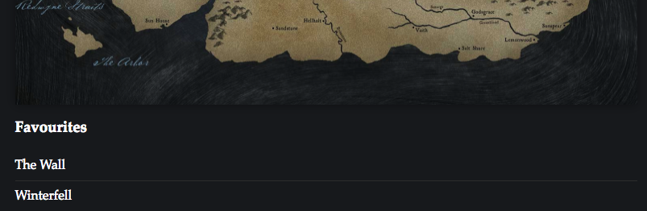

Our next task will be to create a component that displays a list of the places
on the map that we marked as our favourites. This will be a list that we render
under the map.

We will begin by creating a directory in the application for this new component
that we will call `FavouritesList`. That means as before we will first create an
`index.js` file that is responsible for exporting the actual component.

## FavouriteList Component

```js
// app/js/components/FavouritesList/index.jsx

export { default } from './FavouritesList';
```

Next we will go ahead and define some CSS styles that will be used for the list.
Remember that since the `--mapWidth` and `--text`variables are defined in
`App.css`, they are available to this CSS module also.

```css
/* app/js/components/FavouritesList/FavouritesList.css */

.listWrapper {
  width: var(--mapWidth);
  margin: 10px auto 0;
  color: var(--text);
}

.list {
  padding: 0;
  margin: 0;
  list-style-type: none;

  li {
    padding: 10px 0;
    border-bottom: 1px solid #333;

    &:last-child {
      border: none;
    }
  }
}
```

To complete this new component we will now add the `FavouritesList.jsx` file
that contains our markup and logic. We will build a stateless functional
component that accepts a prop called `points` (the list of points we specified
in `Map.jsx`), filters them for points marked as favourites (removing any point
without `favourite: true`) and then renders these into a list.

```jsx
// app/js/components/FavouritesList/FavouritesList.jsx

import React from 'react';
import PropTypes from 'prop-types';

import styles from './FavouritesList.css';

const FavouritesList = ({ points }) => {
  const favourites = points.filter(point => point.favourite);

  return (
    <div className={styles.listWrapper}>
      <h3>Favourites</h3>

      <ul className={styles.list}>
        {favourites.map((favourite, index) => (
          <li key={index}>{favourite.details.name}</li>
        ))}
      </ul>
    </div>
  );
};

FavouritesList.propTypes = {
  points: PropTypes.arrayOf(PropTypes.object)
};

export default FavouritesList;
```

## Rendering the Favourites List

We now want to show our new list on the web page underneath the Map. First of
all though we will need to refactor how our data is handled a little.

Since the `points` data is specified inside of the `Map` component the
favourites list does not know about it. Instead of copying all of the data into
both components we instead will move the data into the `App` component so that
it can pass the `points` array down to both the `Map` and `FavouritesList` as a
prop.

You may have noticed that we already specified that the `FavouritesList` class
accepts a `points` prop:

```jsx
const FavouritesList = ({ points }) => {
```

We will now do the same to the `Map` component.

```diff
// app/js/components/Map/Map.jsx

- const Map = () => {
+ const Map = ({ points }) => {
    return (
      <div className={styles.map}>
        {points.map((point, index) => <Pointer {...point} key={index} />)}
      </div>
    );
  };
```

Now that this component accepts props we will also have to add a prop types
definition.

```diff
// app/js/components/Map/Map.jsx

  import React from 'react';
+ import PropTypes from 'prop-types';

...

+ Map.propTypes = {
+   points: PropTypes.arrayOf(PropTypes.object)
+ };

  export default Map;
```

Finally we will cut the large `points` array out of the `Map.jsx` file and move
it to the `App.jsx` component instead. We can then pass the `points` array as a
prop to the `Map` and our newly added `FavouritesList`. We will also make the
second entry in the posts array a favourite by default in order to show multiple
items in the list.

Apply the following changes to the `App` component:

```diff
// app/js/components/App/App.jsx

  import React from 'react';

  import Map from '../Map';
+ import FavouritesList from '../FavouritesList';

  // eslint-disable-next-line no-unused-vars
  import styles from './App.css';

+ const points = [
+   {
+     x: 450,
+     y: 110,
+     details: {
+       name: 'The Wall',
+       house: "Night's Watch",
+       words: 'Night gathers, and now my watch begins.'
+     },
+     favourite: true
+   },
+   {
+     x: 375,
+     y: 355,
+     details: {
+       name: 'Winterfell',
+       house: 'Stark',
+       words: 'Winter is Coming'
+     },
+     favourite: true
+   },
+   {
+     x: 345,
+     y: 705,
+     details: {
+       name: 'The Twins',
+       house: 'Frey',
+       words: 'We Stand Together'
+     }
+   },
+   {
+     x: 155,
+     y: 775,
+     details: {
+       name: 'The Iron Islands',
+       house: 'Greyjoy',
+       words: 'We Do Not Sow'
+     }
+   },
+   {
+     x: 150,
+     y: 945,
+     details: {
+       name: 'Casterly Rock',
+       house: 'Lannister',
+       words: 'Hear me Roar!'
+     }
+   },
+   {
+     x: 545,
+     y: 1000,
+     details: {
+       name: "King's Landing",
+       house: 'Baratheon',
+       words: 'Ours is the Fury'
+     }
+   },
+   {
+     x: 250,
+     y: 1190,
+     details: {
+       name: 'Highgarden',
+       house: 'Tyrell',
+       words: 'Growing Strong'
+     }
+   }
+ ];

  const App = () => {
    return (
      <section>
-      <Map />
+      <Map points={points} />
+      <FavouritesList points={points} />
      </section>
    );
  };

  export default App;
```

Take a look again in your browser at the changes we have added. If you scroll to
the bottom of the map you will see the locations "The Wall" and "Winterfell" are
in our favourites list since both of these locations have the `favourite: true`
property set in the `points` array.



## Dodgy Data

How about trying to add new places to the list, though? Try toggling a location
such as "King's Landing" to be a favourite on the map. Although the marker turns
red to indicate a favourite the list does not update with the new entry. In the
same manner if you toggle "Winterfell" to no longer be a favourite the map
updates correctly but the list stays the same.

This is because our data is stored inside the `App` component and is being
passed down into the map and the list separately. Essentially we copy the data
to each component and then the `Map`, `Pointer`, and `FavouritesList` components
use internal state / logic to decide what to render based on their initial
props.

Adding the favourites list was not a critical feature but has allowed for the
demonstration of the problem of how it can quickly become difficult to manage
data and state throughout a React application. In the next steps we will look at
using "Redux" which will provide us with a method of storing all of our data in
a central location and then have every component respond when that data is
changed.
