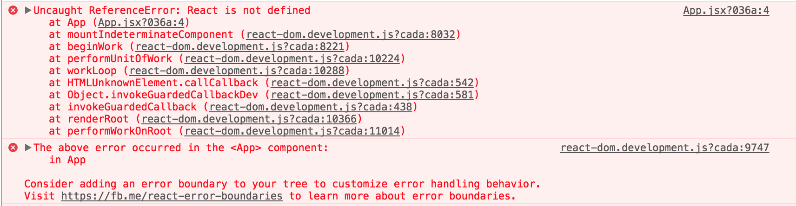
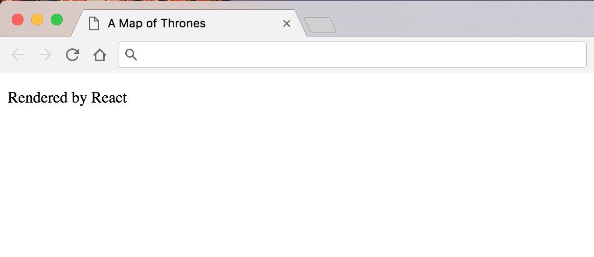

## What is React?

[React](https://reactjs.org/) is a view rendering library developed and actively
maintained by a team of engineers at Facebook. I feel that first of all it is
helpful to clear up a common misconception about what React isn't, rather than
what it is.

React is not a framework but rather a library for developing user interfaces.
The React library does not come with routing, "models" or data management,
network request helpers, or even a test suite.

Since React has a large community around it there are however many libraries
that you can plug into your application that provide these features to you as a
developer in a "React way". For example,
[React Router](https://github.com/ReactTraining/react-router) for navigation or
[Redux](https://redux.js.org/) for managing data. To make a network request you
don't add something like jQuery, you just use the browsers native `fetch`
function.

#### So, what exactly is React then?

The best explanation would come directly from Facebook: [^1]

> **Declarative**
>
> React makes it painless to create interactive UIs. Design simple views for
> each state in your application, and React will efficiently update and render
> just the right components when your data changes. Declarative views make your
> code more predictable and easier to debug.
>
> **Component-Based**
>
> Build encapsulated components that manage their own state, then compose them
> to make complex UIs. Since component logic is written in JavaScript instead of
> templates, you can easily pass rich data through your app and keep state out
> of the DOM.
>
> **Learn Once, Write Anywhere**
>
> We don’t make assumptions about the rest of your technology stack, so you can
> develop new features in React without rewriting existing code. React can also
> render on the server using Node and power mobile apps using React Native.

#### Live updates / renders

Each React component has a `render` method that defines which DOM will be
returned when the component is rendered to the screen. As the Facebook
explanation states, React only updates the parts of your DOM that have changes
attached. It does this by using a virtual DOM to diff the current DOM in the
browser, calculating what needs to change, and only changing those parts.

React understands what will change by looking at `state` and `props`. React
components can have internal `state`, which when changed, causes a re-render of
this component. `props` are basically HTML attributes, such as `href` for an
`<a>` tag. State can be passed down to child components via props, and when
these change a re-render is also triggered.

This means that React component can update to live changes, for an example see
the [Markdown example](https://reactjs.org/#a-component-using-external-plugins)
on the React.js homepage.

## What is JSX?

As mentioned in previous steps of this tutorial, React has a special syntax
called JSX. JSX is an "XML-Like Syntax for JavaScript". [^2]

Although it is possible to write React components without JSX, using vanilla
JavaScript, it is most common to use the JSX syntax. JSX can look very strange
if you have never worked with it before however it starts to feel very natural
after a little experience.

Let's take an example of a JSX React component and see what it would compile
down to. All JSX scripts should have a `.jsx` extension in order to
differentiate from standard JavaScript.

```jsx
// HelloMessage.jsx

class HelloMessage extends React.Component {
  render() {
    return <h1>Hello {this.props.name}</h1>;
  }
}

<HelloMessage name="Ned Stark" />;
```

This is a simple example but you can already see some of the fundamentals of
React. We have an ES6 `class`, extending the methods from a `React.Component`.
We have the `render` method which returns the JSX that we are building. The JSX
is a `<h1>` tag, which as you can imagine, is the same a `<h1>` in regular HTML.
We then interpolate a dynamic variable into the content of the H1,
`this.props.name`. As can be seen on the final line, you pass the name `prop`,
the same an attribute in HTML.

The final output rendered to the web page would be:

```html
<h1>Hello Ned Stark</h1>
```

As I mentioned earlier, you do not necessarily have to write React in JSX
syntax. The previous code sample would compile down to:

```js
class HelloMessage extends React.Component {
  render() {
    return React.createElement('h1', null, 'Hello ', this.props.name);
  }
}

ReactDOM.render(
  React.createElement(HelloMessage, { name: 'Ned Stark' }),
  mountNode
);
```

So although this may look a little more natural, using JSX allows you to work
files. So even though it can feel like going backwards to attach events using
with the templating language alongside your logic directly in the JavaScript
uses a component based mindset, so keeping all logic in one place starts to make
`onClick` handlers etc. to your components, it is important to remember React
sense.

## Writing our first Component

Now that we have a better understanding of React Components, let's implement our
first one in the tutorial project.

We will start by installing the React dependency.

```bash
yarn add react
```

Next we will create a directory for out components, and a directory for you main
`<App />` component.

```bash
mkdir app/js/components
mkdir app/js/components/App
```

We can now create our App component in this directory by creating a file called
`App.jsx`. We will start by importing `React` and `Component` into the file.

Note: Whenever you use JSX in a file, you must import `React` even if you do not
use the variable directly, otherwise the component will not compile and you will
see the following console error:



```jsx
// app/js/components/App/App.jsx

import React, { Component } from 'react';
```

Next we will create a class called `App`, extended from `Component`, that has a
`render` method.

```jsx
// app/js/components/App/App.jsx

import React, { Component } from 'react';

class App extends Component {
  render() {}
}
```

We can now specify the content that we want to render on the web page.

```jsx
// app/js/components/App/App.jsx

import React, { Component } from 'react';

class App extends Component {
  render() {
    return <p>Rendered by React</p>;
  }
}
```

Finally we will specify that `App` is the default export for this JavaScript
module.

```jsx
// app/js/components/App/App.jsx

import React, { Component } from 'react';

class App extends Component {
  render() {
    return <p>Rendered by React</p>;
  }
}

export default App;
```

### Managing imports

When importing from JavaScript modules, the file `index.js` will automatically
be loaded if no filename is specified in the import in the file path.
i.e.`import components/App;` is the same as `import components/App/index;`

For this reason we will always define an `index.js` file that is responsible for
exporting the classes and functions defined within out component files.

To do this we create an `index.js` file in our "App" directory and export the
default component from there.

```js
// app/js/components/App/index.js

export { default } from './App';
```

## Render the app with React DOM

React DOM is responsible for selecting the DOM node that will contain the React
application and rendering the compile contents of our `<App />` component into
it. First of all add the package via yarn.

```bash
yarn add react-dom
```

Finally, we will update our `application.js` file to import the `render` method
from `react-dom`, import our `<App />` component, select the `#app` div that we
have already added to our `index.html` file and glue it all together.

```js
// app/js/application.js

import React from 'react';
import { render } from 'react-dom';

import App from './components/App';

render(<App />, document.getElementById('app'));
```

Now, build the app by running `yarn dev` and open `index.html` in your browser
and you will see "Rendered by React" in a paragraph tag on the page.



## Stateless Functional Components

Finally we can clean this up a little. Since React 14 [^3] we no longer
necessarily need to import `Component` and use a class for a React component. If
the component does not need to use internal state or lifecycle methods you can
simply use a function that returns the JSX content. Let's refactor the `<App />`
component to see an example.

```jsx
// app/js/components/App/App.jsx

import React from 'react';

const App = () => {
  return <p>Rendered by React</p>;
};

export default App;
```

Run `yarn build` again and refresh `index.html` and you will see the content of
the browser are still the same.

---

* <sup id="fn-1">[1]</sup>: https://reactjs.org/
* <sup id="fn-2">[2]</sup>: https://facebook.github.io/jsx/
* <sup id="fn-3">[3]</sup>:
  https://hackernoon.com/react-stateless-functional-components-nine-wins-you-might-have-overlooked-997b0d933dbc
