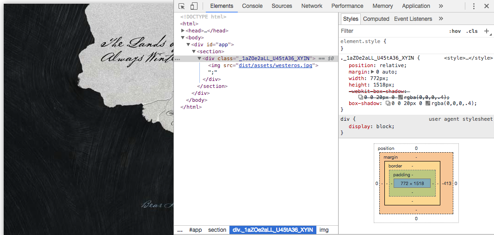
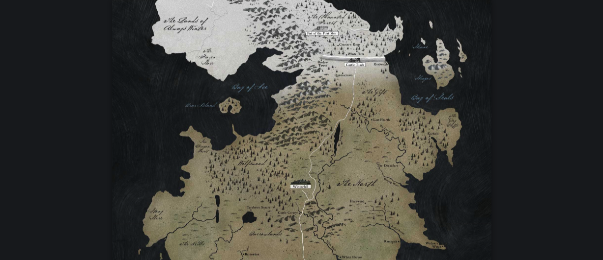

We now have the map rendered to the screen but we don't yet have any styles.
Let's add the ability to style the project to make it look better. We could
style the project with a regular CSS but instead let's look at using CSS
modules.

## CSS Modules

Because we are using Webpack, we can easily add support for CSS modules. CSS
Modules allow us to split our CSS into separate files that map to different
components of our application. Since we are using React, which is based on
components these 2 technologies play very well together.

An advantage of using CSS modules is that class names no longer need to be
unique across the whole application. In one module you could have a class name
called `.info` with a text color green. In another module you can also use the
name `.info` but have red text.

This is possible because when using a CSS module, you import it and apply an
imported style as a class name. When the application is compiled a unique hash
is built for each class name, so from your point of view as a developer 2
modules can use the same class name, in reality everything will be unique. For
example [^1]:

```html
// styles.css

.title {
  background-color: red;
}

// index.js

import styles from "./styles.css";

element.innerHTML =
  `<h1 class="${styles.title}">
     An example heading
   </h1>`;
```

This will compile to the final following HTML:

```html
// index.html

<style type="text/css">
._styles__title_309571057 {
  background-color: red;
}
</style>

<h1 class="_styles__title_309571057">
  An example heading
</h1>
```

## PostCSS

CSS Modules are not in the official CSS spec, meaning we can not simply use them
in the browser. However, they are available with [PostCSS](http://postcss.org/).
PostCSS also offers the ability to use other new features available from "CSS
Next" [^2] (features which are planned for the CSS spec but not implemented yet)
such as variables, mixins, nesting, and, functions. People who have used
SASS/SCSS may be familiar with should be familiar with these, except now we do
not need to the SASS plugin or filetypes.

### Installing PostCSS

Let's start by integrating PostCSS with our Webpack build. As always, let's
first install the necessary dependencies. We will first the Webpack
`postcss-loader`. PostCSS features are separated into different packages
depending on the features you need so we will also install `postcss` for the
core PostCSS functionality, `postcss-nested` to have a SASS-like nested syntax,
and `autoprefixer` to automatically handle our vendor prefixes.

Finally we will install `style-loader` and `css-loader` as fallback loaders for
Webpack to use to process styles.

```bash
yarn add postcss postcss-nested postcss-loader style-loader css-loader autoprefixer
```

Next we will set up a configuration file for PostCSS, detailing which plugins we
want it to use. Create a file in the root of the project called
`postcss.config.js` and add the following configuration that tells PostCSS that
we want to use the nested and autoprefixer plugins.

```js
// postcss.config.js

module.exports = {
  plugins: [require('autoprefixer'), require('postcss-nested')]
};
```

Finally we will extend the `loaders` section of our `webpack.config.js` file and
instruct Webpack to look for all `.css` files (except inside `node_modules/`)
and use the loaders we installed, in order.

```js
loaders: [
  ...
  {
    test: /\.css$/,
    exclude: /node_modules/,
    use: [
      {
        loader: 'style-loader'
      },
      {
        loader: 'css-loader',
        options: {
          modules: true
        }
      },
      {
        loader: 'postcss-loader'
      }
    ]
  }
]
...
```

First Webpack will try to parse styles and then look for regular CSS files. Note
that we tell Webpack that we plan to use CSS modules by passing `modules: true`
to the `css-loader` options. Finally we apply the PostCSS loader which will take
care of handling all of the modern syntax that we will be writing.

## Writing our first CSS Modules

Everything is now setup, let's add our first CSS module for the `<Map />`
component.

Create a file called `Map.css` in the Map component directory. There we will add
a simple class name for the map and write some simple CSS to center it on the
screen and add a border shadow.

```css
/* app/js/components/Map/Map.css */

.map {
  position: relative;
  margin: 0 auto;
  width: 772px;
  height: 1518px;
  box-shadow: 0 0 20px 0 rgba(0, 0, 0, 0.4);
}
```

Next we will import this CSS module into our React component and apply the
styles.

```jsx
// app/js/components/Map/Map.jsx

import styles from './Map.css';
```

Next we will add a wrapper around our `` tag and apply the `.map` styles.

```jsx
// app/js/components/Map/Map.jsx

const Map = () => {
  return (
    <div className={styles.map}>
      ;
    </div>
  );
};
```

It is important to note here when using React due to "class" being a reserved
word in JavaScript, and ultimately JSX compiles ot JavaScript you must always
apply classes with the `className` prop instead.

Now run `yarn dev`, take a look at our web page and see that the map has been
styles applied and if you open the developer console, you will see the generated
hash that is applied by the CSS module. You may also notice that our PostCSS
plugins are working because the `box-shadow` rule has been automatically vendor
prefixed.



## Exploring PostCSS and CSS Modules

We are no confident that we can apply CSS to the project but currently the map
is not looking very good. Let's go ahead and theme the project that we have and
at the same time learn how to use the "CSS Next" features that PostCSS is
providing us.

First we will update the Map from using an `` tag to being a background
image. This will allow us to support high definition screens by using the
`background-size` rule.

```diff
/* app/js/components/Map/Map.css */

.map {
  position: relative;
  margin: 0 auto;
  width: 772px;
  height: 1518px;
  box-shadow: 0 0 20px 0 rgba(0, 0, 0, 0.4);
+ background-image: url('../../../img/westeros.jpg');
+ background-size: 772px 1518px;
}
```

We can then also update the Map component because it no longer needs the
` tag or the westeros graphic to be imported.

```diff
// app/js/components/Map/Map.jsx

import React from 'react';

import styles from './Map.css';
- import westeros from '../../../img/westeros.jpg';

const Map = () => {
  return (
-    <div className={styles.map}>
-      ;
-    </div>
+    <div className={styles.map} />
  );
};

export default Map;
```

If you run `yarn dev` again and view the changes, you will see the map is
already looking better.

#### Using CSS variables

Our CSS module is now using the width and height values twice. Let's clean this
up by using CSS variables to set the value and apply them using the `var`
syntax.

```css
/* app/js/components/Map/Map.css */

.map {
  --mapWidth: 772px;
  --mapHeight: 1518px;

  position: relative;
  margin: 0 auto;
  width: var(--mapWidth);
  height: var(--mapHeight);
  box-shadow: 0 0 20px 0 rgba(0, 0, 0, 0.4);
  background-image: url('../../../img/westeros.jpg');
  background-size: var(--mapWidth) var(--mapHeight);
}
```

#### Styling global elements

At this point it would be good to have the background of the page match the map
a little better. When using CSS modules with React, no module can be applied
directly to the body but we can still style the body by adding rules for it in
any CSS module.

As it would be confusing to style the body inside the CSS component for the Map,
it is a better practise to create a CSS module for your root `<App />` component
and put all global styles (and variables) there.

Let's create an `App.css` file in the App component and back a background color.
We will also add some font rules that we will need later.

```css
/* app/js/components/App/App.css */

body {
  margin: 0;
  padding: 0;
  background: #171a1d;
  color: #fff;
  font-family: Palatino, Georgia, serif;
}
```

We will then also import this module into the `<App />` module. We will also
have to tell ESLint to ignore the `no-unused-vars` rule for that import since we
have to give a variable that the styles are imported to but in this case we have
no class names to actually apply in our markup.

```diff
// app/js/components/App/App.jsx

import Map from '../Map';

+ // eslint-disable-next-line no-unused-vars
+ import styles from './App.css';
```

#### Sharing variables via :root

Finally, let's move the generic values we are using in the `body` to CSS
variables so that they can be used later. Instead of storing them inside the
definition for body, let's look at `:root`.

> The `:root` CSS pseudo-class matches the root element of a tree representing
> the document. In HTML, `:root` represents the `<html>`element and is identical
> to the selector html, except that its specificity is higher. [^3]

This means that definitions done inside of the `:root` selector will be global
to the page, so in order to share variables across CSS modules we can move them
there. Let's now create variables for the generic styles and also move the Map
variables here away from the `Map.css` module.

```diff
/* app/js/components/Map/Map.css */

.map {
-  --mapWidth: 772px;
-  --mapHeight: 1518px;
-
  position: relative;
  margin: 0 auto;
  width: var(--mapWidth);
  height: var(--mapHeight);
  box-shadow: 0 0 20px 0 rgba(0, 0, 0, 0.4);
  background-image: url('../../../img/westeros.jpg');
  background-size: var(--mapWidth) var(--mapHeight);
}
```

```css
/* app/js/components/App/App.css */

:root {
  --background: #171a1d;
  --text: #fff;
  --fontStack: Palatino, Georgia, serif;

  --mapWidth: 772px;
  --mapHeight: 1518px;
}

body {
  margin: 0;
  padding: 0;
  background: var(--background);
  color: var(--text);
  font-family: var(--fontStack);
}
```

Now run `yarn dev` again and refresh the changes to see the application now has
a dark background and the map is still positioned as before.



## Next steps

If you have had enough of constantly typing `yarn dev` then luckily the next
step is to introduce `webpack-dev-server` which will take care of building out
app each time we change a file.

---

* <sup id="fn-1">[1]</sup>: https://css-tricks.com/css-modules-part-1-need/
* <sup id="fn-2">[2]</sup>: http://cssnext.io/
* <sup id="fn-3">[3]</sup>:
  https://developer.mozilla.org/en-US/docs/Web/CSS/:root
