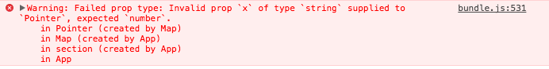
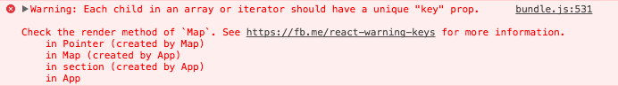
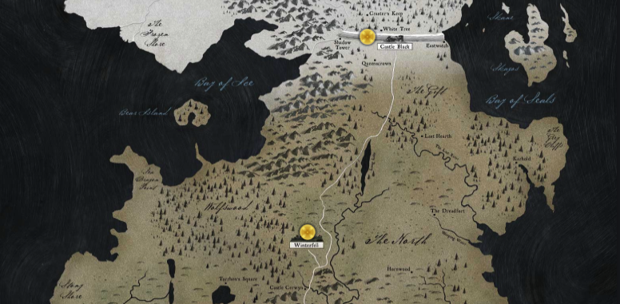

We will now begin to add some pointers to indicate places the map. This will
involve defining data about what we want to show on the map and where. We will
then build a new React component that will display an icon at the positions we
specify on the map.

## Defining the Pointer Data

We are going to use a predefined list of "points" to apply to the map. You can
imagine that we could load this data from a web server at some point but for now
we will use a static object.

This data will live inside of the Map component since it will be responsible for
rendering the pointers to the map.

Take the following data and copy it to the `Map.jsx` file above the `Map`
constant.

```js
// app/js/components/Map/Map.jsx

const points = [
  {
    x: 450,
    y: 110,
    details: {
      name: 'The Wall',
      house: "Night's Watch",
      words: 'Night gathers, and now my watch begins.'
    }
  },
  {
    x: 375,
    y: 355,
    details: {
      name: 'Winterfell',
      house: 'Stark',
      words: 'Winter is Coming'
    }
  },
  {
    x: 345,
    y: 705,
    details: {
      name: 'The Twins',
      house: 'Frey',
      words: 'We Stand Together'
    }
  },
  {
    x: 155,
    y: 775,
    details: {
      name: 'The Iron Islands',
      house: 'Greyjoy',
      words: 'We Do Not Sow'
    }
  },
  {
    x: 150,
    y: 945,
    details: {
      name: 'Casterly Rock',
      house: 'Lannister',
      words: 'Hear me Roar!'
    }
  },
  {
    x: 545,
    y: 1000,
    details: {
      name: "King's Landing",
      house: 'Baratheon',
      words: 'Ours is the Fury'
    }
  },
  {
    x: 250,
    y: 1190,
    details: {
      name: 'Highgarden',
      house: 'Tyrell',
      words: 'Growing Strong'
    }
  }
];
```

## Pointer Component

We will now build a `<Pointer />` component that will show each location on the
map. When clicking on this pointer a popup window will show with the extra
details for each location.

Since this component will have to manage state we will not be using a stateless
functional component but instead a class that extends `React.Component`.

We will start by adding our `index.js` file in the directory for the Pointer
component that will manage our imports and exports.

```js
// app/js/components/Pointer/index.js

export { default } from './Pointer';
```

We then create the `Pointer` class in the `Pointer.jsx` file. For now let's add
a simple render method that will return a `<div />` which controls the styles
for our pointer. We will add a `style` prop that sets the `left` and `top`
properties of the pointer which we read form the `x` and `y` values of our data.

```jsx
// app/js/components/Pointer/Pointer.jsx

import React, { Component } from 'react';

class Pointer extends Component {
  render() {
    const { x, y } = this.props;

    return <div style={{ left: x, top: y }} />;
  }
}

export default Pointer;
```

Notice that we are using the ES6 destructuring assignment [^1] to pull the `x`
and `y` props into constants. This is a nice shorthand instead of having to
access the values manually. Here is an example of how destructuring works:

```js
// Old approach (< ES6)
var x = this.props.x,
  y = this.props.y;

// Destructuring (ES6 >)
const { x, y } = this.props;
```

### Adding PropTypes

At this point ESLint should be highlighting the `x` and `y` values inside of
your editor on line 8 in red because there is an error here. React has a concept
of "Prop Types" which allows you to specify for each component what data type
you expect for each of the incoming props. When you then supply an invalid type
(for example, a number instead of a string), React will warn you in the console
[^2].



Let's add a Prop Types definition to this component in order to remove the
errors. The `PropTypes` class lives in a node module `prop-types`. Since this is
a dependency of `React` itself we already have this installed so now we can
simply import `PropTypes` and set the `propTypes` attribute of our class.

We will specify that `Pointer` has `x` and `y` props that should be numbers and
are not optional. `PropTypes` has an API for more complex data types such as
unions of types. You can read the `prop-types` documentation for more complex
examples.

```diff
// app/js/components/Pointer/Pointer.jsx

  import React, { Component } from 'react';
+ import PropTypes from 'prop-types';

  class Pointer extends Component {
    ...
  }

+ Pointer.propTypes = {
+   x: PropTypes.number.isRequired,
+   y: PropTypes.number.isRequired
+ }

  export default Pointer;
```

## Styling the Pointer

Next we can add a CSS module to manage the styles of the pointer itself. We will
be using a background image so go ahead and copy the `pointer.png` image from
`.assets` into our application.

```bash
cp .assets/pointer.png app/img
```

Let's create a CSS module for the Pointer with some variables and basic styles.
Notice that we set `position: absolute` on the pointer. When combined with the
`top` and `left` styles that are applied in the `Pointer` component's `style`
prop we see how the pointer will be placed on the map.

```css
/* app/js/components/Pointer/Pointer.css */

:root {
  --pointerColor: #000;
  --pointerSize: 20px;
  --detailsBackground: #333;
}

.pointer {
  position: absolute;
  background: var(--pointerColor);
  width: var(--pointerSize);
  height: var(--pointerSize);
  border-radius: var(--pointerSize);
  box-shadow: 0 0 2px 2px rgba(0, 0, 0, 0.5);
  background: url('../../../img/pointer.png') center center no-repeat;
  background-size: var(--pointerSize) var(--pointerSize);

  &:hover {
    cursor: pointer;
  }
}
```

Finally we will import the styles into the Pointer component and apply the
`.pointer` class name to the pointer `<div />`.

```diff
// app/js/components/Pointer/Pointer.jsx

  import React, { Component } from 'react';
  import PropTypes from 'prop-types';

+ import styles from './Pointer.css';

  class Pointer extends Component {
    render() {
      const { x, y } = this.props;

-     return <div style={{ left: x, top: y }} />;
+     return <div className={styles.pointer} style={{ left: x, top: y }} />;
    }
  }

  ...
```

## Wiring the Pointer to the Map

Let's see if our `<Pointer />` component is working by adding instances of them
to the map. We will update the `<Map />` component to import `Pointer` and then
for each item in the points data, render a `<Pointer />` component inside of the
map.

```diff
// app/js/components/Map/Map.jsx

  import React from 'react';

+ import Pointer from '../Pointer';
  import styles from './Map.css';

...

  const Map = () => {
-   return <div className={styles.map} />;
+   return (
+     <div className={styles.map}>
+       {points.map((point, index) => <Pointer {...point} key={index} />)}
+     </div>
+   );
  };
```

In this new code we are mapping over the `points` data array and for every point
we return a `<Pointer />` and we "spread" the `point` object as the props. The
`...` spread operator acts the same as passing:

```jsx
<Pointer x={point.x} y={point.y} details={point.details} />;
```

Finally we pass a `key` prop which is important when you are mapping over data.
This allows React to differentiate between each item in the list so that it can
determine which ones have updated [^3]. The value of `key` must be unique for
each element in the list so we use the `index` of the array item that we are
currently on. If you forget the `key` prop in a list, React will show a warning
(and also ESLint will consider this an error and warn you too.)



## Next Steps

At this point if you look at the project in the browser, you will see yellow
markers at different locations over the map.



The next step will be to use the internal `state` of a React component to hide
or show the details of each pointer.

---

* <sup id="fn-1">[1]</sup>:
  https://developer.mozilla.org/en-US/docs/Web/JavaScript/Reference/Operators/Destructuring_assignment
* <sup id="fn-2">[2]</sup>:
  https://reactjs.org/docs/typechecking-with-proptypes.html
* <sup id="fn-3">[3]</sup>: https://reactjs.org/docs/lists-and-keys.html#keys
